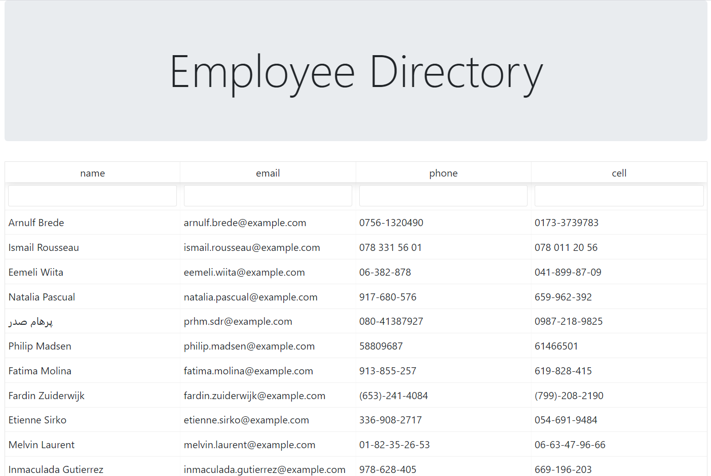

# Employee Directory 

This app brings up a random list of employees containing their name, email, phone, and cell. They are sortable in ascending and descending order by each individual columnn. This project was made using react to learn the how components and react-specific npm packages can work. 

[Link to the project](https://kenneth-dy.github.io/employee-directory/)